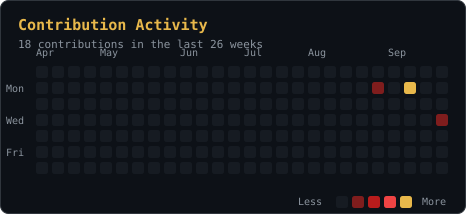

  

  
  

---

### 👨‍💻 About Me

Hello there! I'm **Harsh Kumar**, a B.Tech Computer Science & Engineering student (2023–2027) at Technocrats Institute of Technology, Bhopal. I build full-stack applications — from Spring Boot backends to React frontends.

- 💼 **Java Programming Intern** @ Ramraj Technology Solutions — 40+ JUnit/Mockito tests, PostgreSQL schema design with JPA/Hibernate
- 🏢 **Technology Job Simulation** @ Deloitte — user stories, sprint prototypes, technical design
- 🚀 **MetaTrack** — real-time crypto dashboard (React, Vite, CoinGecko API): markets, watchlists, portfolio, alerts
- 📱 **ClubFit** — cross-platform gym management app (React Native, Firebase) for 150+ members; led a 4-member team
- 🧠 250+ DSA problems solved · 5★ HackerRank Problem Solving
- 👥 Core member, Coding Club — mentored 60+ juniors in DSA

### 🛠️ Tech Stack

  

### 📊 GitHub Stats

  
  

### 📈 Activity

  

### 🚀 Featured Project

  

**MetaTrack** — a modern cryptocurrency tracking website: live CoinGecko markets, watchlists, portfolio tracking, price alerts, asset comparison, multi-currency support, and a full account system with Google sign-in via Supabase.

